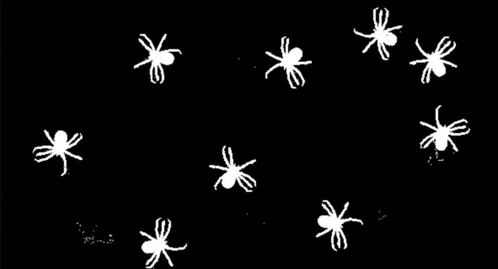

# Bug Motion Tracker
**Merav Joseph 200652063 & Shir Amir 209712801**

The program attemps to track multiple objects (in our case bugs).

### Algorithm & Implementation Details

We used several computer vision techniques to create the multi-detector.

#### Background Subtraction
First of all, in order to detect motion within the video, we applied *background subtraction* between each pair of subsequent frames. 
In general, background subtraciton computes the pixel-wise subtraction between to subsequent frames. 
As consequence, the areas that changed between the two images would be indicated. 
We use the `createBackgroundSubtractorMOG` function in openCV which implements a Gaussian Mixture-Based background subtraction.



#### Morphological Transformations
As noticed in the previous image, some non relevant areas turn white due to shadowing and lumination problems.
Also, the regions which represents moving objects sometimes contains holes and seems as a group of points rather than a whole object. Inorder to fix that we use the morphological operators *dilate* and *erode*.  
Dilation consists a convolution of an image with some kernel, causing the object (in white) to swell.  
On the other hand, erosion computes a local minimum on the area of the kernel thus thinning the object.

#### Contour Recognition
At this points we aim to recognize the contours of each moving object. For this task we use the `findContours` funciton in openCV.
We consider only the contours larger than a threshold size in order to eliminate noise.
Then we use the centriods of each contour as their representative.
The results are pleasing:


#### Hungarian Algorithm
After we identified each object, we must assign the new recognition to previous tracked objects. 
We use the *Hungarian Algorithm* to preform this task. 
This algorithm calculates the best matching in a complete bipartite graph such that the edges' costs are minimized. In our case, one side of the bipartite graph contains the tracked objects and the other side contains the newly recognized obejcts. Our cost function is the distance between centroids. 
At the end of this stage, we have an assignment between the tracked objects and the newly recognized contours.

#### Dealing with Extreme Cases
In order to deal with extreme cases which include new objects entering, old objects leaving, object merging and spliting simultaneously we applied several techniques. 

* **Remove unreasonable assignments** - As consquence of aforementioned extreme cases, one may witness the Hungarian Algorithm assign a pair very far from each other. 
It usually happens when an object leaves and a new one comes in simultaneously or if two objects merge and another one comes in. 
In order to avoid such cases, we remove all the assignments in which the distance is larger than a certain threshold. 

* **Penalty Method** - This method tries to deal with merging and splitting of bugs. 
In such cases, some objects may be unidentified for several frames despite their existance in the frame. 
In order to avoid recognizing these objects as new objects, we charge each object with a penalty for being unrecognized.
Once an object passes the penatly threshold, it is deleted.
This happens when an objects remains unidentified for several subsequent frames.  

At last, all the unassigned newly detected centriods are assigned as new objects.

### Results
We test our results using videos given by the course's staff.

#### :beetle: Ladybug :beetle:
The ladybug's video is the simplest testing video. 
It features a single ladybug walking slowly through the frame. 
The algorithm easily manages this video and tracks the ladybug.  


#### Spiders
The sipders' video is slightly more complicated. It involves several objects rather than just one, and also features merging and spliting of objects. 
Despite that, the algorithm does well in this case too.


#### :honeybee: Bees :honeybee:
The bees' video features multiple objects collision and multiple entrances and exits. Thanks to the extreme case handling we are able to follow each object in this video aswell.


#### Cockroaches
The cockroaches' video is by far the most complicated one, as it features multiple simultaneous entrances, exits, merges and splits. In this video we have more noticable errors. Nevertheless, most bugs are consistently tracked.


### Building Instructions
Building the project is pretty simple. Just clone the `bugTracker` directory into your computer.
Before running the program, make sure your python configuration complies with [README](../README.md) specifications.

### Using Instructions

1. Open the command line in `src` directory.

      
    
2. Run our GUI by typing `python gui.py` into the command line.  
    
        
    
    At this point the GUI window will be opened:  
    
      
    
3. Configure the program's setting by pressing the correlating buttons on the left:  

    <p>
      
    
    * **Load Video** for loading a new testing video.
    * **Output Dir** for chossing the resulted output directory.
    * **Start** for beginning the tracking.
    </p>

4. When pressing one of the aforementioned buttons the file explorer will be opened:

      

    Then choose the requested file for *Load Video* or a directory for *Output Dir*.

5. Next, configure the programs parameters on the right by inserting a different value into each textbox:

      

6. You may enable and disable the debug mode by pressing the checkbox. Debug mode allows you to follow the proccess frame by frame, by pressing `Enter` to continue to the next frame.

      

7. After configuring the program, start tracking by pressing the *Start* button. 

      

8. Then a window with the resulting video will appear:

      
    
    Also, the result will be saved in the output directory which is `results` directory by default.
    One can close the result window by pressing *Esc* button.

9. During the video streaming you can use the instructions on the left for smart inspection:

      

10. In order to close the program, one can simply press *Esc* or close in manually.

#### Directory Tree

This is the tree of our project:

```
bugTracker
├── results
├── src
│   ├── bug.py
│   ├── gui.py
│   └── track.py
├── utility
├── videos
└── guide.md 
```

The `results` directry is the default location of our results and contains results for example.  
The `src` directory contains all our code. Inside it, the file `bug.py` contains the class implementation of each object (in our case bug), the file `gui.py` contains the GUI's code and the file `track.py` contains the function that implements the tracking.  
The directory `utility` contains utility images and .gif files for the guide, and the directory `videos` contains the example videos.
