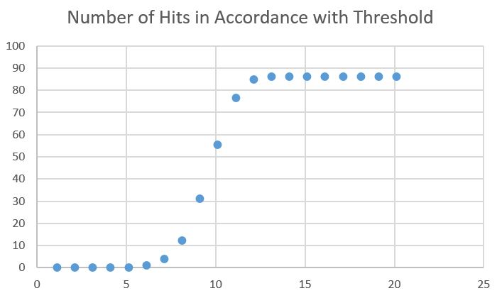
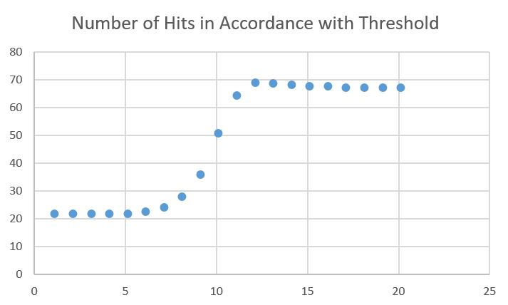

# Facial Recognition using Training Set
**Merav Joseph 200652063 & Shir Amir 209712801**

The program attemps to detect faces in an image and recognize the faces that appear in the training set.

### Algorithm & Implementation Details
Our program contains 2 main stages - Training and Testing.  
The training stage analyzes several data sets, each containing face images of a certain person. 
On the other hand, the testing stage detects new faces in an image and classifies them into the 
labels from the training stage.

Here is what both stages do in a nutshell:  

__Train:__     
    1. Detect & align all faces in training sets.  
    2. Compute the eigenfaces on all the faces.  
    3. Compute the parameters needed for test stage.  

__Test:__  
    1. Detect & align faces in the test image.  
    2. Compute the distance between each new face and each data set.  
    3. Classify each face to a person in the database or determine it isn't in the database.

#### Training 
During the training stage, several data sets are processed in order to achieve essential data. 
That includes the eigenfaces, the mean projections and their covariance matrices of each person.  
The eigenfaces are acquired by applying the Principal Component Analysis 
([PCA](https://en.wikipedia.org/wiki/Principal_component_analysis)) on all the acquired faces. 
Then, we acquire the projection of all the faces in the data set on the face space.  
Afterwards, we obtain the parameters required for calculating the 
[Mahalanobis Distance](https://en.wikipedia.org/wiki/Mahalanobis_distance) between each test face and
a labeled person's set of faces. This distance is later used to classify the test faces.
The Covariance Matrix of each training set is estimated using the projected faces of each person, 
while the mean projection is also calculated using the projected faces.  
At last, all this valuable data is stored in CSV files.

#### Testing
During the testing stage, a new image is analyzed in attempt to recognize the faces in it.  
At first, we use the [Viola-Jones](https://en.wikipedia.org/wiki/Viola%E2%80%93Jones_object_detection_framework)
algorithm for fast face detection. Then, we calculate the 
[Mahalanobis Distance](https://en.wikipedia.org/wiki/Mahalanobis_distance) between each newly detected face and
each training set. The calculation is done using the data obtained in the training stage.  
We chose this measuring method because it uses the standard deviation of the cluster as a measurement unit. 
This means it considers a deviation from a tight cluster more severely than in a spreaded cluster. And is thus 
"smarter" than less sophisticated measurements.  
After that, we look for the label that minimized the distance for each test face, and assign that label to it. 
If the minimal distance overshoots a certain threshold, it is considered to be very far from all the data sets 
and is assigned the 'unknown' label. 

### Results
In order to provide comprehensive information about our systems capabilities, we tested it in several ways. 
Here we will elaborate on some.   

#### Testing Database Images
The simplest test is to try to recognize the very images the system was trained on.
Thus, we wrote the function `multi_test` in `test.py`. The function simply tests each image in the database that was used for training and returns the percentage of images that were recognized correctly and the complementary percentage of the images recognized incorrectly. 

The results were pleasing. As the threshold rises, they converge to *86%* hit and *14%* miss.  
The minimal threshold to give this pleasing result was 13.

  

#### Testing False Positives
Later, we explored what happens when the system has to handle images that aren't in the database.
We added them to our testing set under the label 'unknown' and ran the same test.

In this case the results were less pleasing yet acceptable. As the threshold rose the hitting ratio increased, until reaching a maximum point at threshold value 12 with *69%* hit and *41%* miss. Then, the hitting ratio decreases towards a stable value.  

  


### Building Instructions
Building the project is pretty simple. Just clone the `facialRecognition` directory into your computer.
Before running the program, make sure your python configuration complies with [README](../README.md) specifications.

### Using Instructions
1. Open the command line in `src` directory.

      
    
2. Run our GUI by typing `python gui.py` into the command line.  
    
        
    
    At this point the GUI window will be opened:  
    
      
    
3. Configure the program's setting by pressing the correlating buttons on the left:  
    <p>
      
    
    * **Add Training Set** for adding another person to the training set.
    * **Set Tested Image Path** for choosing the image to be analysed.
    * **Set Output Directory** for choosing the directory for results.
    </p>

4. When pressing one of the aforementioned buttons the file explorer will be opened:

      

    Then choose the requested file for *Set Tested Image Path* or a directory for *Add Training Set* or *Set Output Directory*. 

    <span style="color:blue"> ***NOTE:*** The directory chosen for *Add Training Set* should contain images of the added person <span style="color:red"> **only** </span>. Also, the name of the chosen directory will be the label of the added person. </span>

5. Next, configure the classification threshold on the right by inserting a different value into the textbox:

      

5. After configuring the program, train the system by pressing the *Train* button. 

      

    During the training process the *Train* button will be pressed: 

      

    Once training is finished, the following message will appear on screen:

      

    <span style="color:blue"> ***NOTE:*** Do not press the training button multiple times, be patient until training is completed. </span>

6. After training is complete, test your example by pressing *Test* button:

      

7. Then a window with the resulting image will appear:

      
    
    Also, the result will be saved in the output directory which is `results` directory by default.
    One can close the result window by pressing *Esc* button or closing it manually.

8. In order to close the program, one can simply press *Esc* or close in manually.

#### Directory Tree

This is the tree of our project:

```
facialRecognition
├── images
│   ├── train_data_set
│   └── utility
├── results
├── src  
│   ├── utility
│   │   ├── haarcascade_eye.xml
│   │   └── haarcascade_frontalface_default.xml
│   ├── eigenfaces.py
│   ├── gui.py
│   ├── test.py
│   ├── trian.py
│   ├── train_data.npz
│   └── result.csv
└── guide.md 
```

The sub-directory `images` contains all the images we use in the program. The database training images are in `training_data_set` directory and the images used to generate the guide are in `utility` sub-directory.  
The sub-directory `results` is the default location for the program's output.  
The sub-directory `src` contains all our code. The sub-directory inside it named `utility` contains the haarcascades used in *Viola-Jones* face detector.  
`eigenfaces.py` contians all the code regarding computation and analysis of *eigenvectors*, `train.py` contains the code that trains the database images and `test.py` contains the code that tries to recognize faces from the database in a new image.  
Also, `train_data.npz` contains the data acquired in the training stage and `result.csv` contains the analysis of the results.  
Finally, `gui.py` contains the GUI implementation and is the file one must run inorder to activate the program.  
