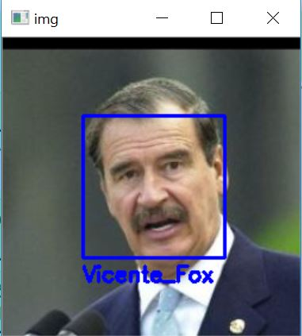

# Facial Recognition using Training Set
**Merav Joseph 200652063 & Shir Amir 209712801**

The program attemps to detect faces in an image and recognize the faces that appear in the training set.

### Algorithm & Implementation Details
Our program contains 2 main stages - Training and Testing.  
The training stage analyzes several data sets, each containing face images of a certain person. 
On the other hand, the testing stage detects new faces in an image and classifies them into the 
labels from the training stage.

Here is what both stages do in a nutshell:  

__Train:__     
    1. Detect & align all faces in training sets.  
    2. Compute the eigenfaces on all the faces.  
    3. Compute the parameters needed for test stage.  

__Test:__  
    1. Detect & align faces in the test image.  
    2. Compute the distance between each new face and each data set.  
    3. Classify each face to a person in the database or determine it isn't in the database.

#### Training 
1. **Detect & align all faces in training sets**- We detected the faces in each image using the [Viola-Jones](https://en.wikipedia.org/wiki/Viola%E2%80%93Jones_object_detection_framework) algorithm for fast face detection.
Using the ROI detected by Viola-Jones suffices as alignment. We tried playing with the *scale factor* and *minimal neighbors* parameters in the Viola-Jones algorithm but found that the detection precision and recall do not significantly change.

2. **Compute the eigenfaces on all the faces**- In order to compute the eigenvectors we had to address the face images as vectors with the images' size dimensions. We computed the eigenfaces by appling *Singular Value Decomposition* ([SVD](https://en.wikipedia.org/wiki/Singular_value_decomposition)) on a matrix that contains each image vector subtracted by the mean image vector.

3. **Compute the parameters needed for test stage**- Our test stage required several different parameters besides the eigenvectors: the mean projection for each person and the covariance matrix of the newly detected faces. These both are needed in order to calculate the [Mahalanobis Distance](https://en.wikipedia.org/wiki/Mahalanobis_distance), on which we will elaborate in the test stage.  
We acquired the average projection by projecting each image on the eigenvectors and simply calculating the mean value. When using an considerable amount of images (for a standalone computer to handle) usually the 100 most significant eigenvectors will suffice to estimate the projection. Hence, we take in account 100 eigenvectors correlating to the highest eigenvalues.  
The covariance matrices were acquired by calculating the covariance matrix of each projection.  
Finally, the requested parameters are saved in `train_data.npz`. 

#### Testing
1. **Detect & align faces in the test image**- Similar to the same part in the training stage, we used Viola-Jones algorithm for face detection and it's ROI as a alignment.  

2. **Compute the distance between each new face and each data set**- We decided to use the [Mahalanobis Distance](https://en.wikipedia.org/wiki/Mahalanobis_distance) as our measuring method. We chose this measuring method because it uses the standard deviation of the cluster as a measurement unit. This means it considers a deviation from a tight cluster more severely than in a spreaded cluster, and is thus "smarter" than less sophisticated measurements.  
The mahalanobis distance between an observation x and a set of observations with mean mu is calculated as: 
, 
when S is the covariance matrix of x. Thus, one needs the covariance matrix of the newly detected face and the mean projection of a person inorder to compute their Mahalanobis distance.  

3. **Classify each face to a person in the database or determine it isn't in the database**- After we calculated the Mahalanobis Distance between each newly detected face and each person in the database, we classified each face as the person closest to it. If the distance between the new face and its closest person was larger than a certain threshold, we classified it as 'unknown'.  

### Results
In order to provide comprehensive information about our systems capabilities, we tested it in several ways. 
Here we will elaborate on some.  

#### Measuring Methods
We measure our success with to different measures - *precision* and *recall*.  
Assume one wishes to select relevant data out of many data items. A solid way to measure his success is by checking how many relevant points were selected and how many of the selected points were relevat.


That is precisely what presicion and recall measure. Precision checks how many selected items are genuinely relevant while recall checks the amount of relevant items that were selected.


#### Testing 10 Faces
At first, we used 10 datasets of different people in order to train the system. Then we tested the system by trying to recognize a set of images. Most of the images were indeed of people from the training datasets, yet we included some images of people which were not trained to explore *false positive* cases.

We measured our preformances in correlation to the minimal distance threshold, by calculating the precision and recall. 


As one can see, when choosing the threshold to be 9: recall is approximately 55% and precision is approximately 92%. 

#### Testing on Training Images
Another great test to check if the system works is to use the training images as test images. One would expect that the results would be better than new test images since the system is already familiar with these images. 

We measured our preformances in correlation to the minimal distance threshold, by calculating the precision and recall. 


As one can see, when choosing the threshold to be 9: recall is slightly above 80% and precision is 100% (since there are no irrelevant images to be chosen).

#### Testing on Unseen Images
No image in our test set appears in the training set. Thus, every properly classified image from the test set could qualify as a valid example in this section. Here are a few examples:


#### Adding a Training Set
Another fine test for determining the quality of the system is to add a new face to the training set and examine the consequences. In this case, we will add the *Winona Ryder* set to the database. It can be found under `images` directory. 

Before adding it, Winona's images were categorized as 'unknown':


After adding here to the training set, they were classified as herself:


#### System Disadvatages

Despite the nice results we've shown in the aforementioned sections, our system does encounter several issues. Some of these issues will be addressed with a follow up solution.

1. **Low recall** - Our system has relatively low recall measure, that could be increased only as a trade off of increasing the amount of *false positives*. A solution could be improving the *alignment*. This means to detect facial features in each image and align those features using and affine transformation over the images. 

2. **Unefficient with very small images** - As part of the alignment our system resizes all the images to a constant size. Hence, if there were to be an image with a small face inside it, the face would be resized and as consequnce severely distorted (pixelized and blurred). Thus, it would not be a "real" face and would negatively affect both training and testing stages. A solution would be to create training sets in defferent varing sizes, that would be able to deal with images of different sizes.

3. **Poor face detection** - The first stage in our system is face detection. It is obviously necessary for face recognition. In our system, the face detection was done using the familiar Viola-Jones algorithm. Despite that, the preformaces of the algorithm are very poor (about 50% detection) even after recalibrating the algorithms parameters. A solution would be to substitute the Viola-Jones face detection algorithm with a different more advaced face detector, probably involving machine learning. 

#### Changing the Amount of Eigenfaces
When trying to calibrate our system, we found that increasing the amount of eigenfaces improves the results in measures of recall and precision. That said, at a certain point adding more eigenfaces doesn't help anymore.  
This phenomenon is easy to explain: when increasing the amount of eigenfacess at first, more base vectors are avaliable to construct a face. Since different people have different faces, more base vectors allow discovering more faces. On the other hand, once including most of the eigenfaces which correlate to high eigenvalues, one is left with many eigenvectors that differ from the average face only by minor changes. Thus, they do not help diversify the faces we detect. Hence, using these new eigenfaces doesn't increase the system's preformances. 

### Building Instructions
Building the project is pretty simple. Just clone the `facialRecognition` directory into your computer.
Before running the program, make sure your python configuration complies with [README](../README.md) specifications.

### Using Instructions

1. Open the command line in `src` directory.

      
    
2. Run our GUI by typing `python gui.py` into the command line.  
    
        
    
    At this point the GUI window will be opened:  
    
      
    
3. Configure the program's setting by pressing the correlating buttons on the left:  

    <p>
      
    
    * **Add Training Set** for adding another person to the training set.
    * **Set Tested Image Path** for choosing the image to be analysed.
    * **Set Output Directory** for choosing the directory for results.
    </p>

4. When pressing one of the aforementioned buttons the file explorer will be opened:

      

    Then choose the requested file for *Set Tested Image Path* or a directory for *Add Training Set* or *Set Output Directory*. 

    <span style="color:blue"> ***NOTE:*** The directory chosen for *Add Training Set* should contain images of the added person <span style="color:red"> **only** </span>. Also, the name of the chosen directory will be the label of the added person. </span>

5. Next, configure the classification threshold on the right by inserting a different value into the textbox:

      

6. After configuring the program, train the system by pressing the *Train* button. 

      

    During the training process the *Train* button will be pressed: 

      

    Once training is finished, the following message will appear on screen:

      

    <span style="color:blue"> ***NOTE:*** Do not press the training button multiple times, be patient until training is completed. </span>

7. After training is complete, test your example by pressing *Test* button:

      

8. Then a window with the resulting image will appear:

      
    
    Also, the result will be saved in the output directory which is `results` directory by default.
    One can close the result window by pressing *Esc* button or closing it manually.

9. In order to close the program, one can simply press *Esc* or close in manually.

#### Directory Tree

This is the tree of our project:

```
facialRecognition
├── images
│   ├── test_data_sets
│   ├── train_data_sets
│   ├── utility
│   └── Winona_Ryder
├── results
├── src  
│   ├── utility
│   │   ├── haarcascade_eye.xml
│   │   └── haarcascade_frontalface_default.xml
│   ├── eigenfaces.py
│   ├── gui.py
│   ├── test.py
│   ├── trian.py
│   └── train_data.npz
└── guide.md 
```

The sub-directory `images` contains all the images we use in the program. The database training images are in `train_data_sets` directory and the images used to generate the guide are in `utility` sub-directory. Also, the `test_data_sets` directory contains the images that were tests in the results section. 
The sub-directory `results` is the default location for the program's output.  
The sub-directory `src` contains all our code. The sub-directory inside it named `utility` contains the haarcascades used in *Viola-Jones* face detector.  
`eigenfaces.py` contians all the code regarding computation and analysis of *eigenvectors*, `train.py` contains the code that trains the database images and `test.py` contains the code that tries to recognize faces from the database in a new image.  
Also, `train_data.npz` contains the data acquired in the training stage.  
Finally, `gui.py` contains the GUI implementation and is the file one must run inorder to activate the program.  
