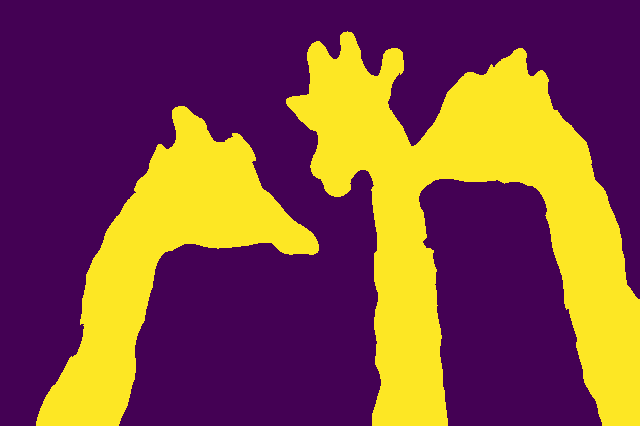
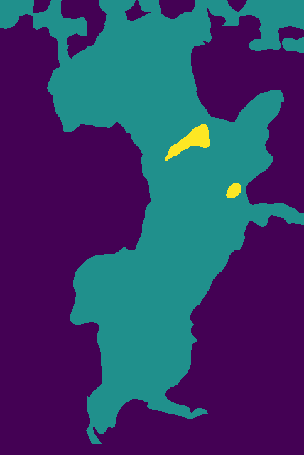
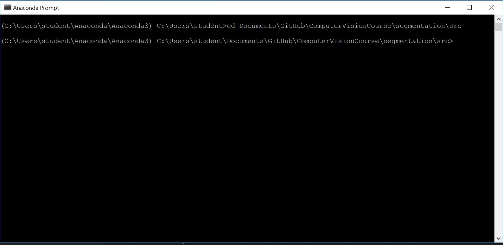

# Semantic Segmentation From a Training Image
**Merav Joseph 200652063 & Shir Amir 209712801**

The program receives a training image, its' segmentation and a new image in the same domain.
Then, the program attempts to segments the new image using the training image labels, similarly to the algorithm described in 
[this article](http://www.math.tau.ac.il/~dcor/online_papers/papers/Yaar05.pdf "Semantic Segmentation, Yaar Et al.").

### Algorithm & Implementation Details
As said, our algorithm heavily relies on the algorithm described in the aforementioned article. Despite that, we implemented a few parts differently. Here is a general description of our algorithm:

1. **Fragmentation** - Divide the tested image into many fragments (or *superpixels*) while trying to make sure each fragment contains pixels from a single segment. 
That is because later we attempt to merge sets of fragments into a common label. We implemented that using "Skicit-Image"'s *SLIC* segmentation.

2. **Determine cost for each fragment and label** - In order to attribute the fragments to the different labels, we must find a way to calculate the profitability of assigning a certain fragment to a certain label.
We do so using *patching method*:

    For each label in the training image we randomly chose several pixels and define a patch of a constant size around them. 
    Thus, each label is attributed with a set of patches. 
    Then for each fragment in the tested image we randomly chose several pixels and define a patch of the same constant size around them. Thus, each fragment is associated with a set of patches.  
    Now, we use these multi-sets of patches to compute distances between each fragment and each label.
    
      
    
    It is important to note that when acquiring patches we subtract the average color of each patch from itself in order to diminish the affect of shadows and high contrast areas.
    
3. **Attribute each fragment to a label** - At first, we thought it would suffice to attribute each fragment to a label in a 
*naive scheme* - each fragment belongs to the label it is closest to. Then after running a few examples, we understood that this simple method doesn't take in account geographical aspects which are crucial for successful segmentation.  
Then, we decided to use the *Grabcut* algorithm and apply it for several labels. Grabcut openCV function requieres input in range [0..1] so we interpolated the distances to that range.  
Also, we noticed that Grabcut works on pixels rather than fragments, thus in order to have all the pixels of the same fragment be attributed to a certain label,
the input image we gave Grabcut is the fragmented image in which each fragment contains its' average color.   
Grabcut requires a mask that will assist in determining background and foreground in an image. A pixel in the mask can hold 4 different values: Background, Foreground, Maybe Background and Maybe Foreground.
We were recommended by our lecturer to compute the mask by determining a threshold such that all values over 1-threshold will be BG, under threshold will be FG.
Now, over 0.5 will be probably BG and under 0.5 will be probably FG.  
Thus, 0.5 could be reffered to as a "maybe threshold". In our enhancements we decided to alter the "maybe threshold" to a more robust result by setting it as the average between mean minimum and mean maximum. 
This allows us to overcome the global segmentation in cases were the distances are not distrbuted uniformly.    
Eventually, we used Grabcut to see which fragments belong to each label. Each grabcut result told us wich fragments a label attributes to itself. 
Now, all we needed to determine is which label gets a fragment if several labels claimed it.  
We used the naive voting scheme - the closest label of all the labels who claimed the fragment receives it. 
Hence, we matched every fragment to its closest label of all the labels which claimed it. When there is a fragment that isn't claimed by anyone we attributed it to its closest label of all the labels.

  

### Results

In this section we will present several results: These results are also avaliable in [results](results) directory.

#### Giraffes
Amount of Fragments: 900, Patch Size: 9, Grabcut Threshold: 0.0001, Grabcut Iterations: 10, SLIC Sigma: 5

  

#### Dog
Amount of Fragments: 700, Patch Size: 9, Grabcut Threshold: 0.0001, Grabcut Iterations: 10, SLIC Sigma: 5

  

#### Texture
Amount of Fragments: 400, Patch Size: 9, Grabcut Threshold: 0.0001, Grabcut Iterations: 10, SLIC Sigma: 5

  

#### Girl
Amount of Fragments: 400, Patch Size: 9, Grabcut Threshold: 0.001, Grabcut Iterations: 7, SLIC Sigma: 5

  

#### Vegtables
Amount of Fragments: 900, Patch Size: 9, Grabcut Threshold: 0.001, Grabcut Iterations: 5, SLIC Sigma: 5

  

***NOTE:*** Our algorithm is not perfect and has its own outliers yet some of them are caused by the resolution of the segmentation.

### Building Instructions
Building the project is pretty simple. 
Just clone the `segmentation` directory into your computer.
Before running the program, make sure your python configuration complies with  
[README](../README.md "README file") specifications.  

#### GUI Doesn't Work
In some systems the GUI may not work because new versions of *PIL* library desist to contain *TK* binding files. 
In this case it's best to uninstall *PIL* and *Pillow* libraries by typing `conda remove PIL` and 
`conda remove pillow` in to the conda prompt. Later, install *Pillow* using *pip installer* by typing 
`pip install pillow` in to the conda prompt. 

### Using Instructions
1. Open the command line in `src` directory.  

      
    
2. Run our GUI by typing `python gui.py` into the command line.  
    
        
    
    At this point the GUI window will be opened:  
    
      
    
3. Choose input images by pressing the correlating buttons on the left:  
    <p>
      
    
    * **Train Image** for choosing the trainning image.
    * **Labeled Image** for choosing the labeling of the trainning image. 
    * **Test Image** for choosing the image to be segmented. 
    </p>
    
4. When pressing one of the aforementioned buttons the file explorer will be opened:  
    
      
    
    Then choose the requested image.  
    
5. The output directory can also be altered in a similar way by pressing 'Output Directory'.  
    
      
    
6. Configure the algorithm parameters by using the entry on the right:  
    <p>
      

    * **Amount of Fragments** configures the amount of fragments in the SLIC algorithm.
    * **Patch Size** configures the size of the patches requiered in the distance determination process.
    * **Grabcut Threshold** configures the threshold requiered for Grabcut algorithm. 
    * **Grabcut Iterations** configures the amount of iterations of Grabcut algorithm.
    * **SLIC Sigma** conrigures the sigma variable (smoothness) of the fragments in SLIC algorithm.
    </p>
    
7. Once completed configurations press the button **GO!** to run the program.  
    
      
    
8. Wait pateintly (running time can take about 30 seconds) at this time the **GO!** button will sink in:  
    
      
    
9. The segmentation results will appear on screen and as a file in the output directory you specified earlier. 

10. You can run the program multiple times by reconfiguring the parameters and pressing **GO!**.   

#### Directory Tree

This is the tree of our project:

```
segmentation 
├── results
├── utility 
├── images
│   ├── image_test
│   ├── image_train
│   └── ...
├── src  
│   ├── gui.py 
│   └── segment.py 
└── guide.md 
```

The sub-directory `src` contains all our code.
`segment.py` contains the implementation of the segmentation algorithm, while `gui.py` contains
the code of our graphical interface.  
In addition, the sub-directory `results` is the default location for the outputted images and contains a few examples. 
Also, all the images we used for testing our program can be found in `images`.
The directory `ulitily` contains images that appear in this guide. 
We took most of our testing images from [pixabay](https://pixabay.com).
Then, we used Photoshop to create the labels. We saved the labels in the following format: 
An image with k segments 0 1 ... k-1 is saved such that every pixel from segment x is valued by x. 
